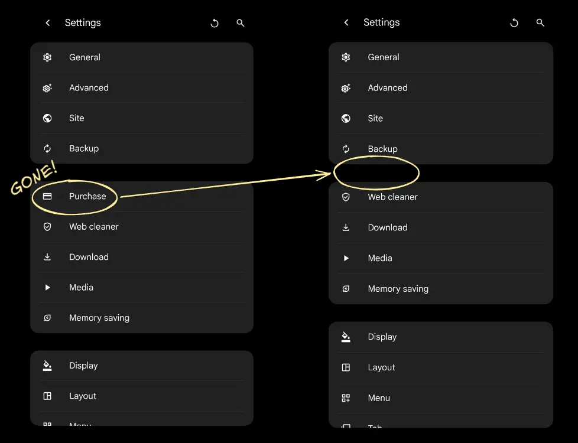
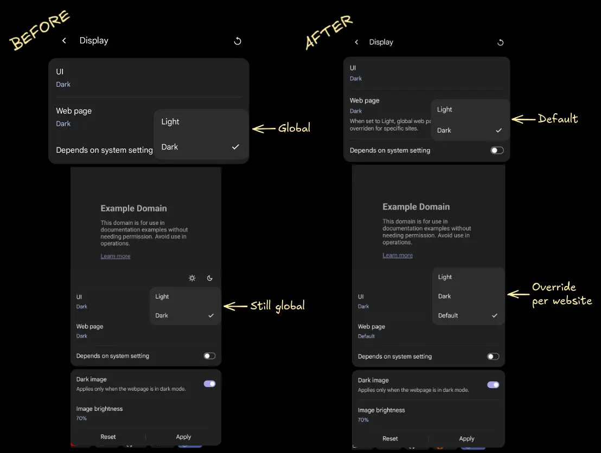
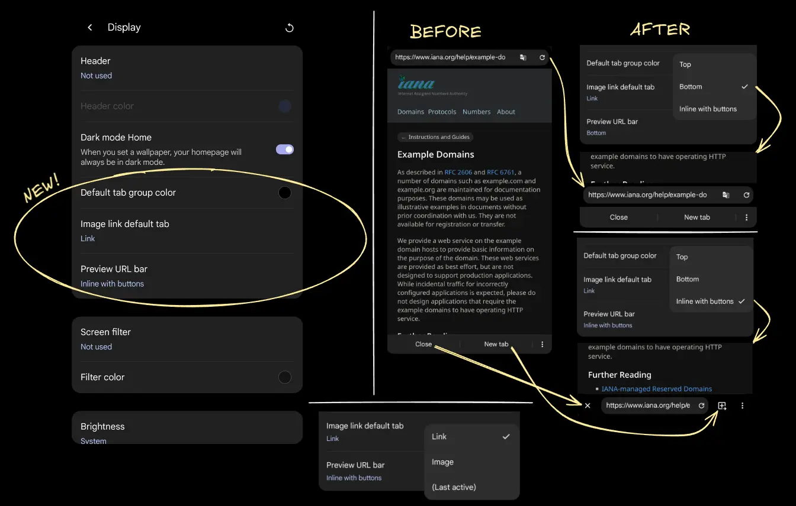
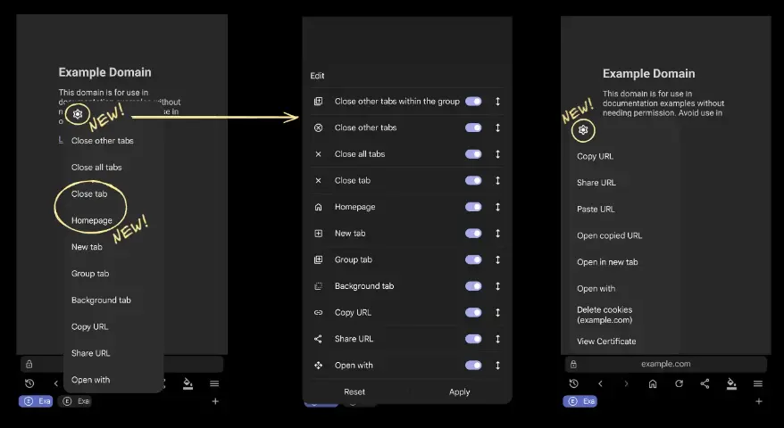
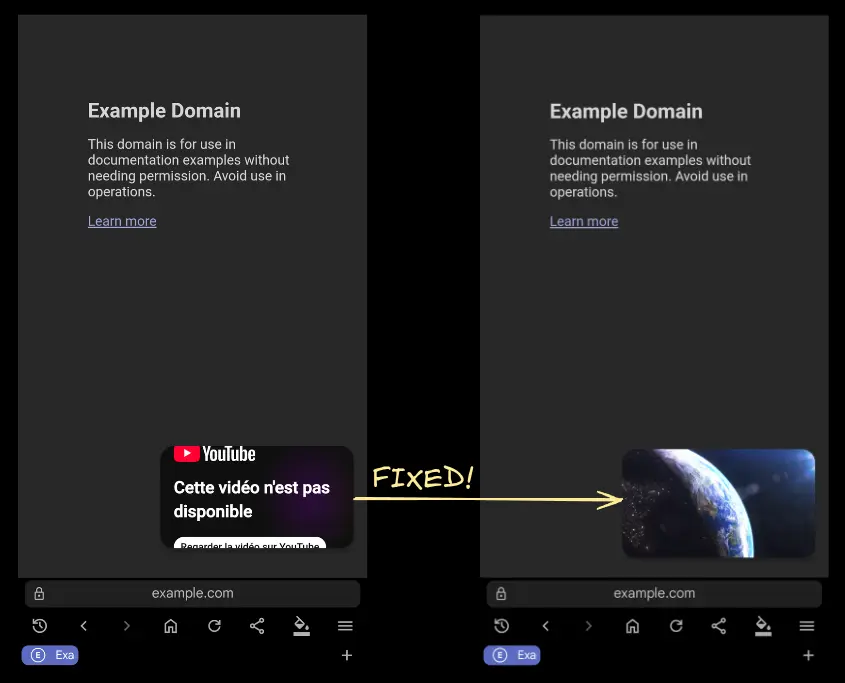
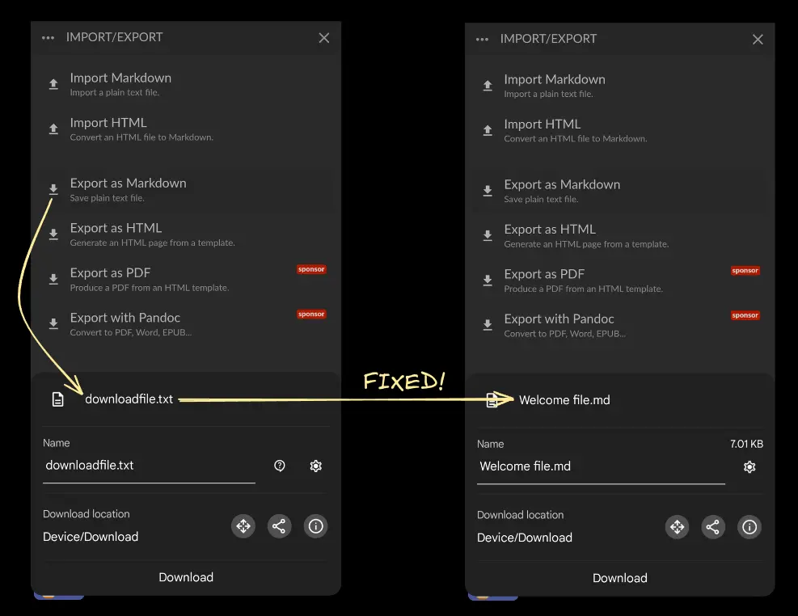
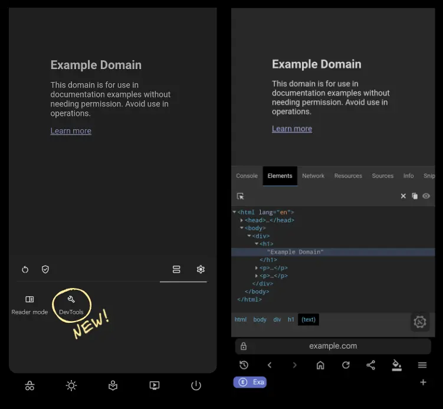
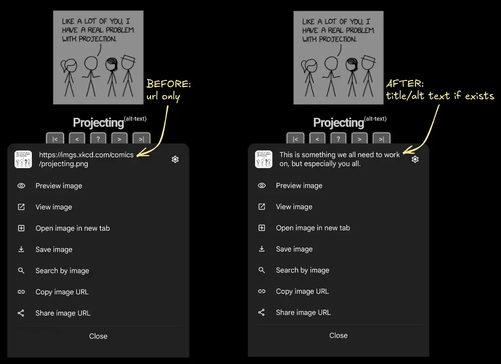
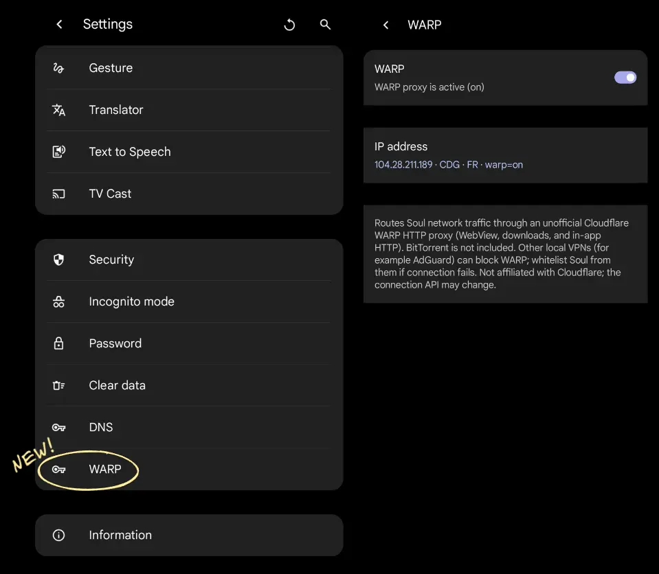

# Soul2 Browser

[](https://git.kaki87.net/VibedByKaKi/soul-browser)
[](https://git.kaki87.net/VibedByKaKi/soul-browser/releases)
[](https://git.kaki87.net/VibedByKaKi/soul-browser)

[](https://github.com/SoulBrowser/SoulBrowser/issues)
[](https://github.com/SoulBrowser/SoulBrowser/issues)
[](https://github.com/SoulBrowser/SoulBrowser)

[](https://github.com/KaKi87/soul-browser-i18n)
[](https://github.com/KaKi87/soul-browser-i18n)
[](https://github.com/KaKi87/soul-browser-i18n)

[](https://discord.gg/4egCwWjyuY)

[](https://apps.obtainium.imranr.dev/redirect?r=obtainium://app/%7B%22id%22%3A%22net.kaki87.soul2%22%2C%22url%22%3A%22https%3A%2F%2Fgit.kaki87.net%2FVibedByKaKi%2Fsoul-browser%22%2C%22author%22%3A%22VibedByKaKi%22%2C%22name%22%3A%22Soul2%20Browser%22%2C%22preferredApkIndex%22%3A0%2C%22additionalSettings%22%3A%22%7B%7D%22%2C%22overrideSource%22%3A%22Codeberg%22%7D)

<!-- BEGIN INFO -->
Soul2 Browser is a decompiled & modded source for [Soul Browser by SoulSoft](https://play.google.com/store/apps/details?id=com.mycompany.app.soulbrowser), which hasn't been updated since v1.4.85 on December 10th, 2025 (since exactly 7 months at "fork" time).

- Fixes long-standing bugs & add long-awaited features ;
- Reports & requests welcome at [the official issue tracker](https://github.com/SoulBrowser/SoulBrowser/issues) ;
- [Original decompiled code](https://git.kaki87.net/VibedByKaKi/soul-browser/src/commit/550ddb041351ebcf37bfc5fb1d3143aaf178b310) & [patches](https://git.kaki87.net/VibedByKaKi/soul-browser/commits/branch/main) both source-available and welcoming contributions ;
- Out of respect for the original developer, all changes to the project will remain minimal and faithful to the original works in terms of branding, architecture, interface, experience and features.
- App is named Soul2 Browser (`net.kaki87.soul2`) for stable builds and Soul2⁺ Browser (`net.kaki87.soul2.testing`) for testing builds; both support configuration import/export in *Settings* -> *Backup* between each other and the official app.
<!-- END INFO -->

**LLM usage disclosure** : the modding code mostly being [Smali](https://stackoverflow.com/tags/smali/info), i.e. the **assembly language** (barely readable layer above **bytecode**) for Android's "Java", a vast majority of it is LLM-generated,
but also extensively tested, both in emulator automatically and on a real phone manually, not to mention I'm daily-driving it.

<details>
<summary>Q&A</summary>

<table>
<tr><td>

Q: Why "source-available" ?<br>
A: The repository cannot be open source for the simple reason that the original Soul Browser is proprietary, therefore any third-party redistribution (including this one) is illegal, despite the circumstances.

</td></tr>
<tr><td>

Q: Why use Soul's bugtracker ?<br>
A: The hope is Soul's creator will eventually notice the continued interest shown by the community for their app, and decide to resume maintenance and backport the added improvements, at which point this modding project will have achieved its goal and be terminated. Think of this as [fanfic](https://en.wikipedia.org/wiki/Fan_fiction).

</table>
</td></tr>

</details>
&nbsp;

|  :new: Ads, trackers & in-app purchases removed  |         :new: Website-specific dark theme          |        :new: More display settings         |
|:------------------------------------------------:|:--------------------------------------------------:|:------------------------------------------:|
|                |                |  |
| :new: **Tab & URL long-press menu improvements** | :hammer_and_wrench: **YouTube Picture-in-Picture** |    :hammer_and_wrench: **JS downloads**    |
|          |               |      |
|             :new: **Eruda DevTools**             |         :new: **Image `title`/`alt` text**         |         :new: **Cloudflare WARP**          |
|                |          |   |

## Exclusive features

### Privacy

All tracking, advertising and in-app purchase services were removed, as per this summarized diff between [the official app's Exodus Privacy report](./exodus_privacy_report_v1.4.85-485.txt) & [the modded one's](./exodus_privacy_report_v2_latest.txt).

<details>
<summary>Diff</summary>

```diff
--- v1.4.85
+++ v2.0.0
 === Information
-- App version: 1.4.85
+- App version: 2.0.0
-- App version code: 485
+- App version code: 2000000
-- App name: Soul
+- App name: Soul2 Browser
-- App package: com.mycompany.app.soulbrowser
+- App package: net.kaki87.soul2
-- App permissions: 27
+- App permissions: 22
-    - android.permission.ACCESS_ADSERVICES_AD_ID
-    - android.permission.ACCESS_ADSERVICES_ATTRIBUTION
-    - android.permission.ACCESS_ADSERVICES_TOPICS
     - android.permission.ACCESS_COARSE_LOCATION
     - android.permission.ACCESS_FINE_LOCATION
     - android.permission.ACCESS_NETWORK_STATE
     - android.permission.USE_FINGERPRINT
     - android.permission.WAKE_LOCK
     - com.android.launcher.permission.INSTALL_SHORTCUT
-    - com.android.vending.BILLING
-    - com.google.android.gms.permission.AD_ID
-    - com.mycompany.app.soulbrowser.DYNAMIC_RECEIVER_NOT_EXPORTED_PERMISSION
+    - net.kaki87.soul2.DYNAMIC_RECEIVER_NOT_EXPORTED_PERMISSION
 - App libraries:
     - org.apache.http.legacy
-    - android.ext.adservices
-=== Found trackers: 3
+=== Found trackers: 0
- - Google Firebase Analytics
- - Google AdMob
- - OpenTelemetry (OpenCensus, OpenTracing)
```

</details>

[Implemented in `94e63e5`](https://git.kaki87.net/VibedByKaKi/soul-browser/commit/94e63e5973b587c33f5d41d55a92243e652efec7) [and `f4b02ef`](https://git.kaki87.net/VibedByKaKi/soul-browser/commit/f4b02ef19b6619a7671c1fd2c589f1591a3cd078).

### YouTube background playback

As it is distributed on Google's Play Store, the official app doesn't support background playback for Google's YouTube.
This mod does and will not have this constraint, so you can now play YouTube in the background without having to use PiP.
[Implemented in `af43286`](https://git.kaki87.net/VibedByKaKi/soul-browser/commit/af43286ada4d1948c71251ea525739bd46f8d6d0).

### PDF previews

No need to download PDFs before reading them anymore. [Implemented in `b16124c`](https://git.kaki87.net/VibedByKaKi/soul-browser/commit/b16124cfea97a20d76c15777b53d4ac1c3532066).

Added share & download buttons to the preview toolbar. [Implemented in `cc7300c`](https://git.kaki87.net/VibedByKaKi/soul-browser/commit/cc7300c16ef4a36ea6dea08232ebac626bf3a808).

### Website-specific dark theme ([#155](https://github.com/SoulBrowser/SoulBrowser/issues/155))

Disable force-dark specifically for websites that are already dark (or look bad with it). [Implemented in `32481a1`](https://git.kaki87.net/VibedByKaKi/soul-browser/commit/32481a1112c28365aefeb69ee29b8c3bedbd94b8).

The opposite, however, is not possible : the webview API does not allow having most websites light by default and a few exceptionally dark.

### Cloudflare WARP

Routes HTTP requests for page loading & file downloading through Cloudflare's VPN & DNS service, increases safety on public networks and bypasses ISP blocks.

⚠️ Does not, however, reliably hide your IP (WebRTC, etc.), bypass geographic restrictions, nor even allow choosing the egress location.

If using AdGuard or other VPN-level content blockers, whitelist Soul for use with WARP.

Powered by [skye-z/amz](https://github.com/skye-z/amz). [Implemented in `d1ec2a8`](https://git.kaki87.net/VibedByKaKi/soul-browser/commit/d1ec2a89ea136a72499fc6f13e402e3db358d740).

### Website data in backup

Save logged in sessions in your Soul Browser backup so you no longer have to log back into websites when doing a restore.

[Implemented in `f537c26`](https://git.kaki87.net/VibedByKaKi/soul-browser/commit/f537c26f192fb7e7afff368cbb9024d9b7b7b512).

### Page preview improvements

**Links & image long-press menu :** was completely unavailable in preview mode, now is. [Implemented in `5f3e8d4`](https://git.kaki87.net/VibedByKaKi/soul-browser/commit/5f3e8d49c082209b38ae848ab029e8f511c1b307)

**URL bar location :** was hard-coded at the top, can now be at the bottom, or even inline with icon-only *close* & *new tab* buttons. [Implemented in `0f2b1c0`](https://git.kaki87.net/VibedByKaKi/soul-browser/commit/0f2b1c0c220ba5dad6bbd7f907f6e115e3def571).

**New tab without reload :** the preview *New tab* button now keeps the existing WebView instead of opening the URL in a fresh tab. [Implemented in `2664b4c`](https://git.kaki87.net/VibedByKaKi/soul-browser/commit/2664b4cf2).

**Copy/share URL without closing :** the "Copy URL" and "Share URL" items from the preview context menu no longer uselessly close the preview on click. [Implemented in `249b015`](https://git.kaki87.net/VibedByKaKi/soul-browser/commit/249b01580695c9ca22d99c849dbdc5955d09fcad).

### Tab bar long-press menu improvements

**Tab favicon & full title :** long-press a tab to see its details just like a hover on desktop would make a tooltip appear. [Implemented in `8c6bec1`](https://git.kaki87.net/VibedByKaKi/soul-browser/commit/8c6bec111b054f1b196beab1b52614d42df9c431).

**Items toggling & sorting :** toggle tab long-press menu items just like link/image long-press menu items. [Implemented in `862ec31`](https://git.kaki87.net/VibedByKaKi/soul-browser/commit/862ec3199560563accea16f3554dff1d1616ae35) [and `c258d50`](https://github.com/KaKi87/soul-browser/commit/c258d50e941e218beb26ef179ffeec5472a8e4ac).

**Close tab :** simply a new menu item allowing closing a tab in the background. [Implemented in `be46c27`](https://git.kaki87.net/VibedByKaKi/soul-browser/commit/be46c27150798d1504161ec7e26d963cd42d880c).

**Tab homepage :** In the fashion of Zen Browser's pinned tabs, pin tabs to a specific homepage by long-pressing the new *Homepage* button, then simple-click it to automatically navigate back to it. [Implemented in `ef6d47f`](https://git.kaki87.net/VibedByKaKi/soul-browser/commit/ef6d47fc9d31152ca4e1187e83e3637a8ba93afc).

### Text selection long-press menu improvements

**Items toggling & sorting :** toggle selected text long-press menu items. [Implemented in `fb8f40f`](https://git.kaki87.net/VibedByKaKi/soul-browser/commit/fb8f40fda0bc8805a85bbafbb10ea37ee5b2bbfe).

**"Search in preview" & "Find in page" :** perform quick actions from selected text without copy/pasting. [Implemented in `509cf1b`](https://git.kaki87.net/VibedByKaKi/soul-browser/commit/509cf1b7dce1e7adefdd616a3f5f7b359ccfe999).

### Tab list improvements

**Copy multiple tab URLs ([#63](https://github.com/SoulBrowser/SoulBrowser/issues/63), [#99](https://github.com/SoulBrowser/SoulBrowser/issues/99)) :** copy a few or all tabs' URLs as a newline-separated list to the clipboard. [Implemented in `bef3fd9`](https://git.kaki87.net/VibedByKaKi/soul-browser/commit/bef3fd901b3101840deedc1c8b4c85acd4bec2bc).

**Range selection :** select a tab, then long-press another, to automatically select all in between. [Implemented in `a445b61`](https://git.kaki87.net/VibedByKaKi/soul-browser/commit/a445b61e55ee296a58390445e0f848828c4d6aa2).

**Drag-n-drop without triggering multi-select :** prevent displaying checkboxes when just wanting to move tabs around. [Implemented in `c30b9da`](https://github.com/KaKi87/soul-browser/commit/c30b9da84506734ab8ac9242d8b91bb049ec4092).

### Misc

**Default tab group color :** was hard-coded to red, now customizable in settings. [Implemented in `a0499b3`](https://git.kaki87.net/VibedByKaKi/soul-browser/commit/a0499b37a5530a6f980e7a1f5e8a387d3889ccdb).

**Default image link long-press menu tab :** was hard-coded to whatever was last used, now customizable in settings. [Implemented in `afa8916`](https://git.kaki87.net/VibedByKaKi/soul-browser/commit/afa8916246d171161057bdc769646b3130ded8b6).

**Full timestamps in history :** With hours, minutes and seconds. Implemented in [`04b85de`](https://git.kaki87.net/VibedByKaKi/soul-browser/commit/04b85de53a4fb0169c0e28968ef6bc5ef79a3e9f).

**URL bar long-press items toggling & sorting :** same as tab bar. [Implemented in `977e078`](https://git.kaki87.net/VibedByKaKi/soul-browser/commit/977e07877f820e628533156f00b056b78c20a2d4).

**"Whole world" & "case-sensitive" for "Find in page" :** just like desktop Firefox, cause even desktop Chrome doesn't have it. [Implemented in `b6d8280`](https://git.kaki87.net/VibedByKaKi/soul-browser/commit/b6d8280e2d75a4a0cedf773be2f7c456fc85775d).

**JSON viewer :** powered by [`pd4d10`'s port](https://github.com/pd4d10/json-viewer) of [Firefox's JSON Viewer](https://firefox-source-docs.mozilla.org/devtools-user/json_viewer/). [Implemented in `8d4aa8364`](https://github.com/KaKi87/soul-browser/commit/8d4aa8364).

**Eruda DevTools :** knockoff element inspector, network logging & JS console, powered by [Eruda](https://github.com/liriliri/eruda). Optional advanced "preload" setting initializes Eruda on every page (hidden) so the menu can open it with logs already captured. [Implemented in `0200adc`](https://git.kaki87.net/VibedByKaKi/soul-browser/commit/0200adc5a111e9648cf1d51c8738bef1e0637a62) [and `48bc818`](https://git.kaki87.net/VibedByKaKi/soul-browser/commit/48bc8186c36c003ac1e02d53f087ec249fe2d01e).

**Advanced option to disable last state restoration :** prevents webapps from showing outdated information when loading after suspension or restart.  [Implemented in `c3f57ee`](https://git.kaki87.net/VibedByKaKi/soul-browser/commit/c3f57ee4ea46b0632f4f65ff36169b1c5ef7c361).

**Image `title`/`alt` text on long-press ([#80](https://github.com/SoulBrowser/SoulBrowser/issues/80)) :** was hard-coded to the image's URL, now provides a more useful description when available. [Implemented in `101b5f2`](https://git.kaki87.net/VibedByKaKi/soul-browser/commit/101b5f21a0698e46a9f4972b32b3c0321f775657).

**"Download link" in long-press menu :** the equivalent of "Save link as..." on desktop. [Implemented in `1ff72c4`](https://git.kaki87.net/VibedByKaKi/soul-browser/commit/1ff72c48c5c15c798efa031a12c85caad9a564bb).

## Exclusive bugfixes

### YouTube Picture-in-Picture

The official app shows "video unavailable" when trying to use PiP on YouTube. [Fixed in `7902fe5`](https://git.kaki87.net/VibedByKaKi/soul-browser/commit/7902fe5f483428f9e83144616a06409689ec5fda).

### Search by image

Google would return 404. [Fixed in `cad7450`](https://git.kaki87.net/VibedByKaKi/soul-browser/commit/cad745025d41fa32b19dc7d22d7ef2b650ff323d).

### JS-triggered & `blob://` file downloads

Downloads generated from web apps would always be named `downloadfile.txt` even when it was supposed to be `Important document.pdf`. [Fixed in `9802419`](https://git.kaki87.net/VibedByKaKi/soul-browser/commit/9802419ea3a34cb33794f3777202192e3730f80d).

Downloads generated with a `blob://` URL would just never fire. [Fixed in `0e33b30`](https://git.kaki87.net/VibedByKaKi/soul-browser/commit/0e33b3083411583ea385a75f0b51171406365902).

Same with downloads generated with a non-image `data:` URL. [Fixed in `c1dc13c`](https://git.kaki87.net/VibedByKaKi/soul-browser/commit/c1dc13ce4c960817b5e417fb6f7ff0caa720d043).

### Misc

**Focus steal from foreground on system quick settings/notifications pane pull-down :** [Android kills memory-hungry apps when the user pulls down the notifications pane](https://gitlab.e.foundation/e/os/android_frameworks_base/-/commit/4f26be3a00ba220b427832e229b79ecbc57b57c1),
which may kill Soul's webview, which in return brings itself to the foreground even when the launcher or another app was active, and respawns the webview process. [Fixed in `7259a2a`](https://git.kaki87.net/VibedByKaKi/soul-browser/commit/7259a2a10bcaf666bdbab4a81ffdec1dfbf59a01).

**Non-JS URL ending with `*.user.js` triggers userscript install :** a page showing a preview of a userscript rather than the raw file (e.g. on a git platform) will unexpectedly trigger the userscript install prompt. [Fixed in `50f75c3`](https://git.kaki87.net/VibedByKaKi/soul-browser/commit/50f75c3054038ee1545c9e464a5b6b711531e627).

**PDF translation fixed on "Updating the text module" :** translation models were downloaded using Google Play Services, which doesn't work on GApps-free devices. [Fixed in `e2c1896`](https://git.kaki87.net/VibedByKaKi/soul-browser/commit/e2c18960ec1748b634022b63a55b9dc3aa7524b5).

**"Incognito tab" listed twice in preview mode menu :** the menu item was duplicated. [Fixed in `8e5a6f3`](https://git.kaki87.net/VibedByKaKi/soul-browser/commit/8e5a6f3e7ba30ca7944373e9aceb80714ab781e5).

**From address bar to "Find in page" :** when clicked fast enough (before the search engine autocompletion results appear), only the first letter of the former's query would make it to the latter. [Fixed in `c322a12`](https://git.kaki87.net/VibedByKaKi/soul-browser/commit/c322a1231771f2cd4f55c2f5da930df8d3f5db6f).

## Known bugs

### YT PiP controls

PiP controls (⏪/⏯️/⏩) don't work on YouTube, the workaround consists in going fullscreen then using YouTube's controls and going back to PiP if desired.

Other sites aren't affected.

It is unknown whether this bug was inherited from the official app (non-testable due to PiP being broken on the official app) or introduced by the PiP fix (introduced due to PiP being broken on the official app).

Repairing this has been attempted multiple times, without success.

### Buggy WebView versions

Some *Android System WebView* versions between 148 and 149 are known to cause [issues with long-press](https://forum.obsidian.md/t/android-long-pressing-items-in-sidebar-views-tabs-more-than-once-makes-the-app-freeze/114189), e.g. menus on images, links, image links, as well as text selection.

In Soul, this translates into the inability to interact with pages (as if frozen) after using long-press twice, the wrong long-press menu appearing when clicking elements of different types, etc.

### Bottom bar overlaps page content

This is an old Soul issue, where, on some pages, sometimes after several clicks, the webview starts expanding below the bottom bar and the latter starts ovelapping the former.

Unfortunately, the issue occurs too rarely for a reliable reproduction scenario to be determined. Any help with that is welcome in #363 !

## Project structure

| Path                    | Description                                                                                 |
|-------------------------|---------------------------------------------------------------------------------------------|
| `app/`                  | Apktool decompilation (smali + resources). This is the buildable source.                    |
| `sources/java/`         | JADX-decompiled Java sources for reference and readability.                                 |
| `sources/resources/`    | JADX-extracted resources.                                                                   |
| `original-dex/`         | Original `classes2.dex` (Java 8+ desugar libs; apktool cannot recompile these reliably).    |
| `splits/`               | Split APK configs (native libs, density) from the original XAPK bundle.                     |
| `scripts/build.sh`      | Local and CI build script.                                                                  |
| `native/soulamz/`       | Go wrapper around unofficial amz WARP HTTP proxy (built to `bundled-warp/`).                |
| `sources/warp-runtime/` | Java helpers for WARP prefs, ProxyController, and settings UI (injected as `classes7.dex`). |

## Build

Requirements: Java 21+, `curl`, `zip`, `keytool`, `jarsigner`. Optional: Android SDK `zipalign`.

```bash
./scripts/build.sh
```

Output APKs are written to `dist/`.

**Source tree vs release APK:** Git stores the testing application ID (`net.kaki87.soul2.testing`, Soul2⁺ Browser). Feature-branch builds should not rewrite package metadata. The stable Soul2 Browser APK (`net.kaki87.soul2`) is built on CI when a tag on `main` sets `SOUL_PACKAGE_ID`. `build_date.xml` and `soul2_info.xml` are generated at build time (not committed). The in-app Information text is defined in the README `<!-- BEGIN INFO -->` section.

The build script:

1. Merges density-specific resources from split APKs in `splits/`
2. Syncs `public.xml` resource IDs from the original `R` classes
3. Rebuilds the base APK from `app/` using Apktool
4. Injects the original `classes2.dex` desugar libraries
5. Injects OCR / WARP helper dexes (`classes5`–`classes7`)
6. Merges native libraries from ABI split APKs and `bundled-warp/`
7. Signs the APK with apksigner (v1+v2+v3)

Local builds sign with a generated `keystore/debug.keystore` (passwords `android` / alias `soulbrowser`) unless you set:

| Variable                 | Purpose                            |
|--------------------------|------------------------------------|
| `SOUL_KEYSTORE`          | Path to a PKCS12/JKS keystore      |
| `SOUL_KEYSTORE_PASSWORD` | Keystore password                  |
| `SOUL_KEY_PASSWORD`      | Key password                       |
| `SOUL_KEY_ALIAS`         | Key alias (default: `soulbrowser`) |

The rebuilt APK is a standalone install (split APK metadata removed from the manifest).

## CI

GitHub Actions workflow [`.github/workflows/build-apk.yml`](.github/workflows/build-apk.yml) builds and uploads APK artifacts on every non-`main` branch push. Plain pushes to `main` and tags whose commit is not on `main` skip the APK job (i18n publish still runs on `main`). When a tag whose commit is on `main` is pushed, CI builds the stable APK, uploads it, runs [εxodus standalone](https://github.com/Exodus-Privacy/exodus-standalone), and may commit `exodus_privacy_report_v2_latest.txt`, `locales_config.xml`, and refreshed prebuilts back to `main`. `bundled-warp/lib/` is in the checkout (gitignored for local adds; CI updates with `git add -f` when `native/soulamz` inputs change). Report-only / prebuilt commits include `[skip ci]` and are ignored by path filters so they do not rebuild the APK or re-run the analysis.

Release signing uses repository secrets (never committed):

| Secret                   | Purpose                                         |
|--------------------------|-------------------------------------------------|
| `SOUL_KEYSTORE_BASE64`   | Base64-encoded keystore file                    |
| `SOUL_KEYSTORE_PASSWORD` | Keystore password                               |
| `SOUL_KEY_PASSWORD`      | Key password                                    |
| `SOUL_KEY_ALIAS`         | Key alias (optional; defaults to `soulbrowser`) |

Example to rotate secrets from a local keystore:

```bash
base64 -w0 keystore/release.keystore | gh secret set SOUL_KEYSTORE_BASE64
printf '%s' "$STORE_PASS" | gh secret set SOUL_KEYSTORE_PASSWORD
printf '%s' "$KEY_PASS" | gh secret set SOUL_KEY_PASSWORD
printf '%s' soulbrowser | gh secret set SOUL_KEY_ALIAS
```

## Decompilation details

- **APK source:** Downloaded from APKPure via [apkeep](https://github.com/EFForg/apkeep)
- **Apktool:** 2.10.0 — smali/resources decompilation and rebuild
- **JADX:** 1.5.0 — Java source decompilation for reference

## Legal notice

Soul Browser is developed by SoulSoft and distributed on Google Play. This repository contains decompiled code for educational and interoperability purposes. All rights belong to the original copyright holders.
